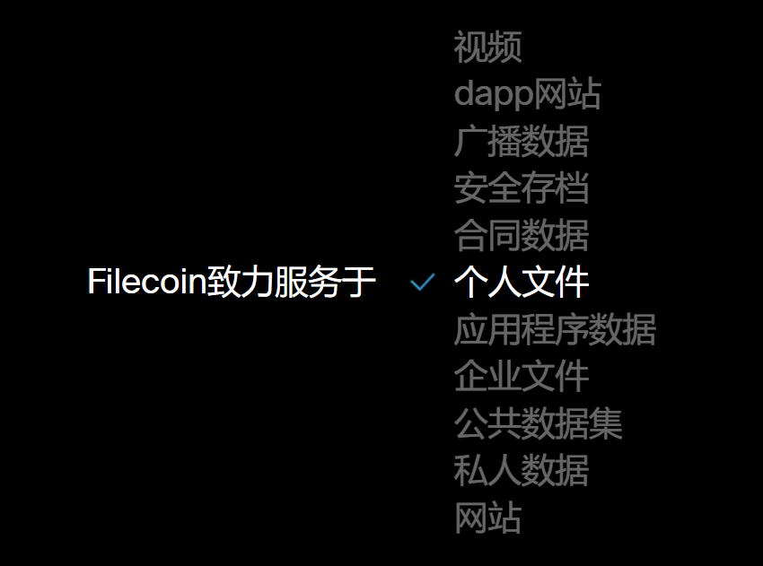
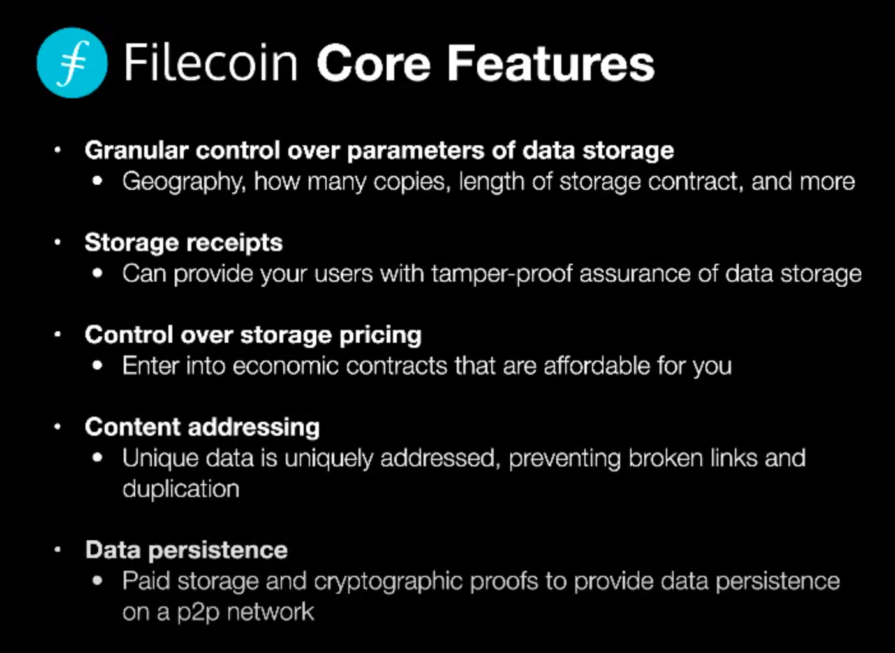

# Filecoin 网络
> 先理解 概念 & 经济模型, 再开始代码的理解&编写
## Filecoin nodes
## Filecoin miners

## Deals
> 在Filecoin中有两种主要的交易类型: 存储交易 和 检索交易。

存储协议是客户端和存储矿工之间在网络中存储一些数据的协议。一旦交易启动，并且矿商已经收到要存储的数据，它将反复向链证明它仍然按照协议存储数据，以便它可以收集奖励。如果不是，矿商将被削减和失去FIL。检索协议是客户端和检索挖掘者(可能也可能不是存储挖掘者)之间的协议，用于提取存储在网络中的数据(希望以快速和可靠的方式)。与存储交易不同，这些交易是在链下完成的，通过支付渠道为接收到的数据逐步支付。

## Proofs
> TIP
> - They must store all the data submitted by the client
>
> - They must store it during the whole lifetime of the deal

证明的过程主要为如下两种方式:

**Proof of Replication**
此证明在交易开始，密封操作完成时提供。

**Proof of SpaceTime**
一旦交易生效并在其整个生命周期内，矿商将使用Proof of Spacetime (PoSt)来证明它仍在存储与交易相关的数据。

### Filecoin verifies storage of data
> use storage space as a Proof of Work

> Filecoin’s Proof of Replication is both a Proof of Storage and Proof of Space, and these are subtly different [explained later]. In Filecoin units of data are stored in what are called sectors. You seal specific data in a sector on disk in a slow encoding process and commit a proof of that to the blockchain. Sealing is an intense amount of work spent on that particular proof. In order to fake a proof like that, you would have to do that particular work using the original data that a client stores on Filecoin, unlike numeric hashes in Bitcoin’s Proof of Work.

Filecoin的复制证明既是存储证明，也是空间证明，两者有细微的不同。在Filecoin中，数据单元存储在所谓的扇区中。在缓慢的编码过程中，您将特定的数据密封在磁盘上的扇区中，并提交一个证明给区块链。在这种特殊的证明上，密封是一项繁重的工作。为了伪造这样的证明，你必须使用客户端存储在Filecoin上的原始数据来完成特定的工作，这与比特币的工作证明中的数字散列不同。

> create a Proof of Space that was also being used to store useful data. So that’s what Proofs of Replication are as foundational primitives in the Filecoin network’s cryptographic protocol

创造一个能够用于存储有用数据的空间证明。这就是复制证明在Filecoin网络加密协议中作为基本基元的作用

> This parameter choice, over the choice of proofs in Filecoin has been probably the biggest reason it s taken us so long to ship all of this stuff. Because you choose one construction and it has a certain shape and produces artifacts of a particular size, and maybe that s fine, and then you tweak some parameter, like, Hey, maybe we want the sectors to be slightly bigger. That makes some other parameter have to change

在Filecoin中，这个参数的选择，而不是证明的选择，可能是我们花了这么长时间才发布所有这些东西的最大原因。因为你选择了一种结构，它有特定的形状，产生特定大小的人工制品，也许这没问题，然后你调整一些参数，比如，嘿，也许我们想让扇区更大一点。这就需要改变其他参数

> I think no other network is using Proof of Replication, it s an advantage we have that we created that field. So that s one differentiating factor. We are also the only one with this fluid market structure that is meant to be optimized based on an ask and bid structure where miners and clients are able to reason about prices together and then form deals out of that. I think we are also the only ones doing consensus backed by useful storage. With other networks it may be a consensus backed by a Proof of Space, but in our case it s useful. Those are the three biggest differentiating factors of Filecoin.

我认为没有其他的网络使用复制证明，这是我们的一个优势，我们创造了这个领域。这是一个微分因子。我们也是唯一拥有这种流动性市场结构的公司，这种结构是基于卖出价结构进行优化的，矿商和客户可以一起推断价格，然后根据这种结构达成交易。我认为我们也是唯一一个以有用的存储为基础来达成共识的。对于其他的网络来说，这可能是一个由空间证明支持的共识，但在我们的情况下，这是有用的。这是Filecoin最大的三个区别因素。

filecoin的存储证明系统官方解释：
[Filecoin’s proof system](https://filecoin.io/blog/posts/what-sets-us-apart-filecoin-s-proof-system/)

## Gas fees

## Actors

> Actors are a software design pattern (opens new window)for managing state. Accounts, Multisigs, Miners, and anything with a state, such as an account balance, are implemented as an actor. Actors are the Filecoin equivalent of smart contracts in the Ethereum Virtual Machine. As such, Actors are very central components of the system. Any change to the current state of the Filecoin blockchain has to be triggered through an Actor

参与者是用于管理状态的软件设计模式(打开新窗口)。帐户、multisig、矿工以及任何具有状态的东西，如帐户余额，都是作为参与者实现的。参与者是Filecoin中的智能合约，相当于以太坊虚拟机中的智能合约。因此，参与者是系统的核心组件。对Filecoin区块链当前状态的任何更改都必须通过Actor触发.

## Addresses

## filecoin四大实现
### lotus
> protocol lab 的官方实现
> 仅支持mac/linux
> 基于Go语言

Lotus是最成熟的Filecoin实现，官方在slack频道上宣布的版本的升级，一般都是Lotus版本的升级，由此可见，Lotus是四大实现中最为“受宠”的实现，Lotus始终是协议实验室他们亲自开发和维护。

### Forest
> ChainSafe团队实现
> 基于Rust语言

Forest是用Rust编写的Filecoin的实现，采用模块化方法来分两部分构建完整的Filecoin节点：

根据Filecoin协议规范，在Rust中构建Filecoin的安全关键系统，特别是虚拟机、区块链和节点系统；

集成功能用于存储采矿、存储与检索市场的组件，以构成功能齐全的Filecoin节点实现。

### Fuhon

Fuhon是由Soramitsu开发的C ++ Filecoin实现，所有C ++依赖项都使用Hunter进行管理，Fuhon的特点是它使用cmake下载所需的库，不需要手动下载和安装软件包。

Fuhon矿工和节点能够实现与Lotus 新版本兼容，实施和运行都经过一致性测试，以确保互操作性；此外，在不久前的TLS修补程序中，启用了Lotus和Forest节点之间的连接，这意味着Fuhon和Lotus以及Forest都是可以互相连接的。

### Venus（go-filecoin）

Venus是由协议实验室发起和开发的第一个Filecoin实现（大概在今年的6月份左右go-filecoin更名为Venus），在Filecoin网络中的角色也是举足轻重的， 在filecoin-project/venus中，我们可以看到有比较多的关于修复gas价格的方案和实施。

Venus的特点是可以在大多数Linux和MacOS系统上构建和运行，但是尚未支持Windows，Venus验证节点可以在大多数具有至少8GB RAM的系统上运行。

## 矿工奖励
> In Filecoin, miners earn different types of rewards by contributing to the network.

> There are two main types of rewards for their efforts: storage fees and block rewards.

奖励分以下三种：
    - Storage fees
    - Block rewards
    - Retrieval fees

### Block rewards

### Retrieval fees
检索协议是客户端和检索挖掘者(可能也可能不是存储挖掘者)之间的协议，用于提取存储在网络中的数据(希望以快速和可靠的方式)。与存储交易不同，这些交易是在链下（off-chain）完成的，通过支付渠道为接收到的数据逐步支付

主要的两种奖励方式(链上)：
    - 存储费用
    - 区块奖励

## Filecoin官方简述的应用场景

> 未突出某个领域的优势

## 核心功能

### 具体案例分析

## Filecoin Discover项目介绍
Discover项目是我们鼓励更多矿工在早期阶段加入网络的办法。我们构建Discover项目作为快速扩展Filecoin网络的一种方式。

Filecoin Discover store是PB级别公共数据的目录（还在不断的增长中），涵盖了文学、科学、艺术和历史等方面。希望加入Filecoin网络的矿工可以访问该站点，选择他们想要存储的数据集，并花费一定成本收到存了已验证数据的硬盘。

## 分布式存储 VS 较传统云
1. 分布式存储由供应关系决定定价 | 会间接造成定价不稳定

